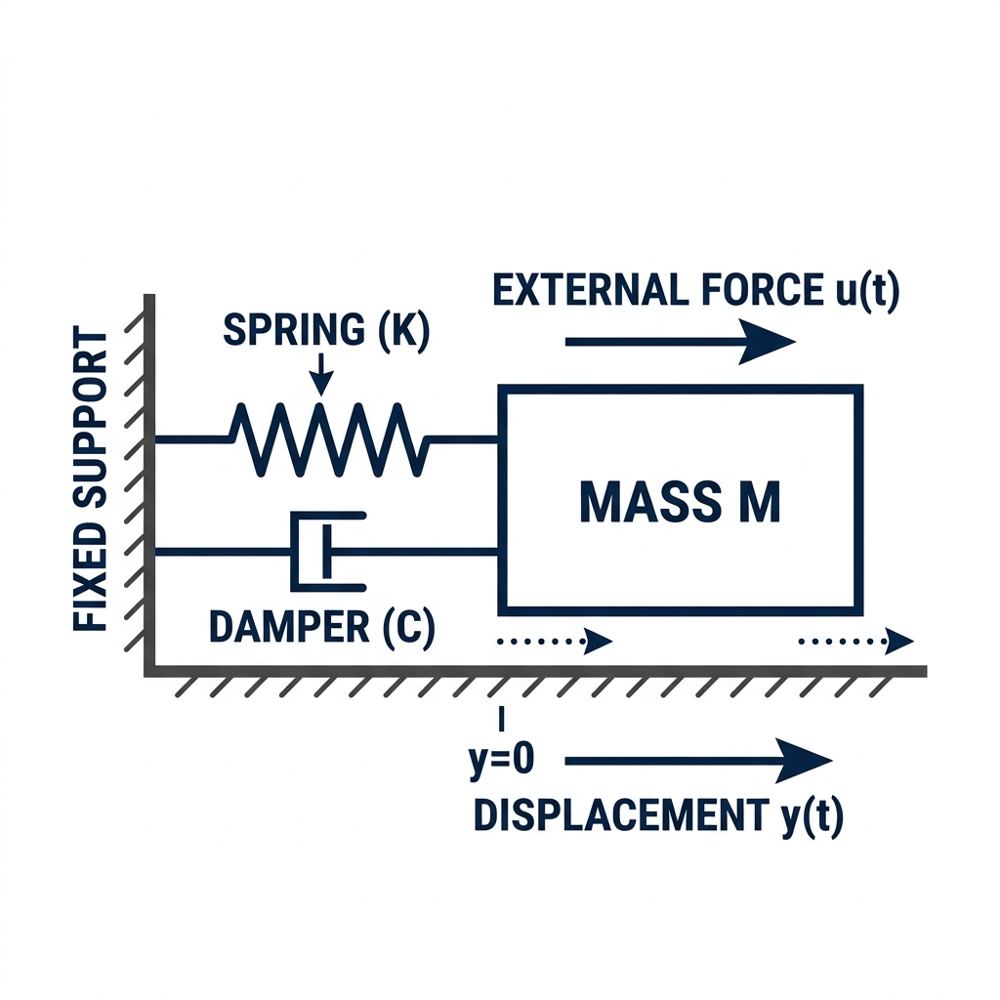
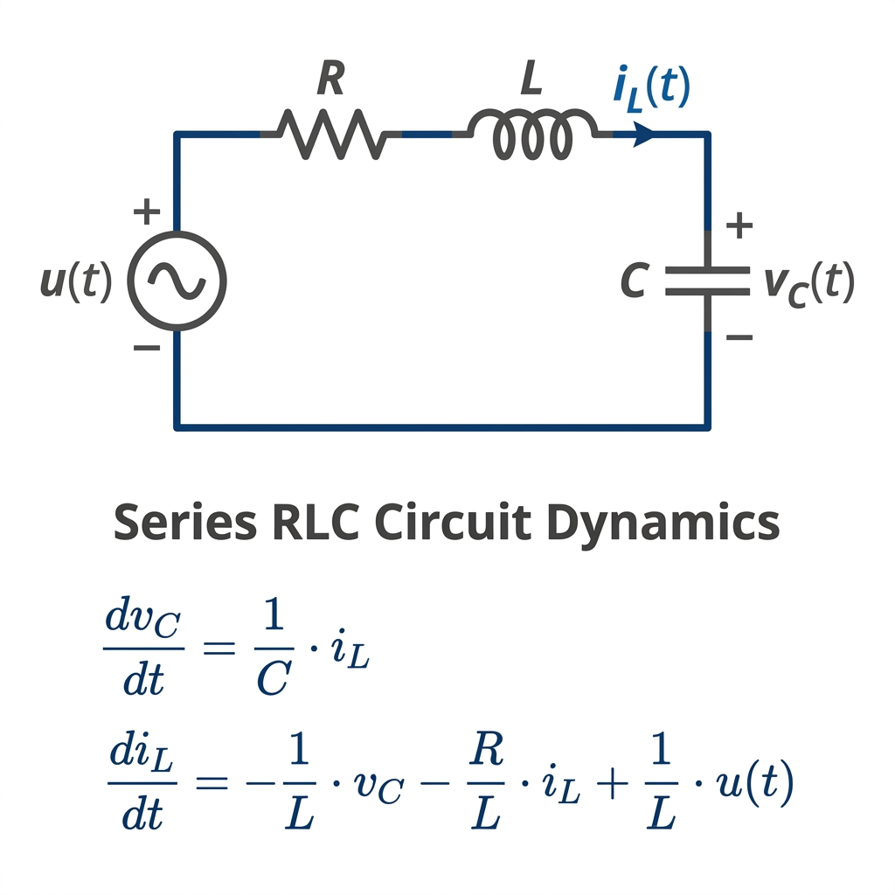

# CrySpace

 

**CrySpace** is a powerful control systems library for the Crystal programming language, inspired by the Python Control Systems Library (`python-control`). It provides tools for the analysis and design of feedback control systems, leveraging [num.cr](https://github.com/eltony81/num.cr) v1.31.0 for high-performance linear algebra.

---

## 📋 Table of Contents

- [🚗 Featured: Active Suspension Storyboard](#-featured-active-suspension-control--end-to-end-storyboard)
- [✨ Features](#features)
- [📦 Dependencies](#dependencies)
- [⚙️ Installation](#installation)
  - [⚡ Vectorized SIMD Mode (Apache Arrow)](#vectorized-simd-mode-apache-arrow)
- [🚀 Usage](#usage)
  - [1. Basic Example: First-Order System](#1-basic-example-first-order-system-non-vectorized)
  - [2. Mechanical Example: Mass-Spring-Damper](#2-mechanical-example-mass-spring-damper-system)
  - [3. Comprehensive Example: RLC Circuit with PID](#3-comprehensive-example-rlc-circuit-with-pid-control)
  - [4. Feedback Connection](#4-feedback-connection-simple-gain)
  - [5. Step Response and State Analysis](#5-step-response-and-state-analysis)
  - [6. General ODE Solving (RK4)](#6-general-ode-solving-rk4)
  - [7. Transfer Function Arithmetic](#7-transfer-function-arithmetic)
  - [8. Bidirectional Conversions](#8-bidirectional-conversions)
  - [9. Advanced Control Design & Analysis](#9-advanced-control-design--analysis)
- [📊 Performance & Benchmarking](#performance--benchmarking)
- [🧪 Testing](#testing)
- [🤝 Contributing](#contributing)
- [⚠️ Known Limitations](#known-limitations)

---

## 🚗 Featured: Active Suspension Control — End-to-End Storyboard

> A complete control engineering journey — from first-principles physics modelling to closed-loop simulation — told as a story, chapter by chapter.

**[▶ Open Interactive HTML Storyboard](https://htmlpreview.github.io/?https://github.com/eltony81/cryspace/blob/main/examples/suspension_storyboard.html)**
> Live Bode plots · MathJax equations · Syntax-highlighted Crystal code · Dark-mode UI

| Resource | Link |
|----------|------|
| 📖 Narrative README | [examples/STORY.md](examples/STORY.md) |
| 🌐 Interactive HTML (rendered) | [suspension_storyboard.html via htmlpreview](https://htmlpreview.github.io/?https://github.com/eltony81/cryspace/blob/main/examples/suspension_storyboard.html) |
| 💎 Crystal source (CPU version) | [examples/36_mega_usecase_storyboard.cr](examples/36_mega_usecase_storyboard.cr) |
| ⚡ Crystal source (Arrow SIMD version) | [examples/40_arrow_storyboard.cr](examples/40_arrow_storyboard.cr) |

The storyboard covers **13 chapters** and **30+ CrySpace functions**: modelling → stability → frequency analysis → LQR → observers → discretization → model reduction → PID → nonlinear analysis → system identification → ODE solvers → closed-loop simulation → plotting.


---

## Features

- **State-Space Systems**: Create and manipulate LTI (Linear Time-Invariant) systems in state-space form ($\dot{x} = Ax + Bu, y = Cx + Du$).
- **Transfer Functions**: Represent systems as ratios of polynomials.
- **High-Performance Linear Algebra**:
  - Leverages **num.cr v1.30.0** with optimized LAPACK/BLAS bindings.
  - Robust **DARE (Discrete-time Algebraic Riccati Equation)** solver using Schur-decomposition (pencil method).
  - Fast **Lyapunov** and **Sylvester** equation solvers ($O(n^3)$).
- **Vectorized Math & Serialization via Apache Arrow**:
  - Run high-performance simulation trajectory math directly on the **ARROW** backend using vectorized C++ compute kernels. Passing an Arrow-backed time/input vector automatically offloads the simulation iterations (`simulate`) to the Arrow backend using zero-copy matrix promotion.
  - In-place arithmetic operations (`add!`, `subtract!`, `multiply!`, `divide!`) and unary negation (`-`) on the Arrow backend leverage SIMD-vectorized C++ compute functions with zero GC memory allocations.
  - Log and save simulation run datasets ultra-fast to disk in memory-mapped columnar binary **Feather** files via `Arrow::FeatherWriter`.
- **System Interconnections**:
  - Parallel connection (`+`)
  - Series connection (`*`)
  - Feedback connection (`feedback`)
- **Stability Analysis**: Calculate system poles.
- **Discretization**: Convert continuous-time systems to discrete-time using optimized **Zero-Order Hold (ZOH)** via augmented matrix exponential.
- **Time Response**:
  - Step response simulation.
  - General ODE solvers (**Euler** and **Runge-Kutta 4**).
- **Advanced Control Algorithms**:
  - Linear Quadratic Regulator (`lqr` and `dlqr`) design.
  - Lyapunov solvers (`lyap` and `dlyap`) for continuous and discrete-time stability analysis.
  - Bode stability margins (`stability_margins`) including Gain Margin and Phase Margin.
  - State-space realizations: convert systems to Observability Canonical Form (`to_observability_form`) and Modal Form (`to_modal_form`).
  - Root Locus: calculate closed-loop pole trajectories under varying gain (`root_locus`).
  - Frequency response data: Bode (`bode_data`), Nyquist (`nyquist_data`), and Nichols (`nichols_data`) data generators.
  - Discrete-to-Continuous time conversion (`to_continuous` / D2C) using matrix logarithm.
  - Actuator-limited PID controller with anti-windup clamping (`PIDController`).
  - Tustin (Bilinear) and Generalized Bilinear Discretization (`sample(dt, method: :tustin)`).
  - Balanced Truncation Model Reduction (`balred`).
  - Optimal Linear Quadratic Gaussian (`lqg`) controller synthesis.
  - Similarity Transformation (`similarity_transform`).
  - Kalman Controllability and Observability Decomposition (`controllable_decomposition` and `observable_decomposition`).
  - Minimal Realization solver (`minreal`) to eliminate uncontrollable and unobservable states.
  - Augmented Integrator system design (`augment_integrator`) for tracking control.
  - Optimal Kalman Estimator Gain solvers (`lqe` / `dlqe`).
  - System Bandwidth (`bandwidth`) calculation.
  - Impulse response (`impulse_response`) and Initial State Free response (`initial_response`) simulation.
  - Public Controllability (`ctrb`) and Observability (`obsv`) matrix helpers.
  - Canonical Transformations: Control Canonical Form (`to_control_canonical_form`) and Observable Canonical Form (`to_observable_canonical_form`).
  - TransferFunction feedback loop solver with configurable signs (`feedback`).
  - TransferFunction pole-zero cancellation (`minreal`) minimal realization.
  - Pade approximation (`TransferFunction.pade`) for time delays.
  - State-Space to TransferFunction conversion (`ss2tf`).
  - Peak Gain (`peak_gain` / H-infinity norm) solver.
  - Loop Margins (`loop_margins` / Nyquist distance bounds).
  - Robust Optimal Control synthesis: $H_2$ (`h2syn`) and $H_\infty$ (`hinfsyn`) state-feedback.
  - Sylvester Equation solver (`sylvester`) for observer and block diagonalization designs.
  - Robust Pole Placement (`place`) for multi-input systems.
  - $H_2$ Norm (`h2norm`) calculation of continuous LTI systems.
  - Matched Pole-Zero discretization (`to_discrete(dt, method: :matched)`).
  - Lead-Lag compensator design (`leadlag`).
  - Loop shaping weight generator (`makeweight`) for robust $H_\infty$ filters.
  - Least Squares System Identification (`least_squares_estimation`) for TF parameters.
  - Eigenvalue Realization Algorithm (`era`) for realization from impulse response data.
  - Describing Functions (`describing_function_saturation`, `describing_function_deadzone`, `describing_function_backlash`) for nonlinear stability analysis.
  - Stability Tests: Routh-Hurwitz (`routh_hurwitz`) and Jury (`jury_test`).
  - MIMO Analysis: Relative Gain Array (`rga`) and Exact H-infinity Norm (`hinfnorm_exact`).
  - Pre-Warped Discretization (`sample(method: :prewarped)`) and Model Residualization (`residual_reduction`).
  - Realization & Fitting: Ho-Kalman (`ho_kalman`), Kung (`kung`), and Levy's Frequency Fitting (`levy_fit`).
  - Identification Signals: PRBS (`prbs`) and Chirp (`chirp`) swept generators.
  - Notch Filter (`notch`) design.
  - PID Tuning: Ziegler-Nichols closed-loop (`pid_tune_zn`) and Cohen-Coon (`pid_tune_cc`).
  - Non-linear Estimators: Extended Kalman Filter (`ExtendedKalmanFilter`) and Unscented Kalman Filter (`UnscentedKalmanFilter`).
  - Trajectory Optimization: Iterative LQR (`ilqr`) solver.
  - Adaptive Control: Model Reference Adaptive Control (`mrac_simulate`).
  - Runge-Kutta-Fehlberg 4(5) Adaptive ODE Solver (`rk45`).
  - Jordan Canonical Form Transformation (`to_jordan_form`).
  - Luenberger Observer (`LuenbergerObserver`) class supporting continuous RK4 integration and discrete-time state updates.
  - Interactive SVG/HTML plotting dashboards: Step Response (`step_plot`) and Bode Diagram (`bode_plot`) using Chart.js CDN.
- **State Estimation**:
  - Discrete-Time Kalman Filter (`KalmanFilter`) implementation.
- **SISO & MIMO**: Support for Single-Input Single-Output and Multi-Input Multi-Output systems.

## Dependencies

CrySpace relies on the following dependencies:

### Shard Dependencies
- **num.cr** (`~> 1.31.0`): High-performance scientific computing and linear algebra library for Crystal.

### System Dependencies
- **LAPACK** (`liblapack-dev` / `lapack` `>= 3.12.0`): Linear Algebra Package for high-performance numerical routines.
- **BLAS/CBLAS** (`libcblas-dev` / `cblas` / `openblas` `>= 3.12.0` / `>= 0.3.26`): Basic Linear Algebra Subprograms interface.
- **Apache Arrow GLib** (`libarrow-glib-dev` / `apache-arrow-glib`): Required for vectorized SIMD features and Arrow backend support (in both `cryspace` and `num.cr`).

### Language / Compiler
- **Crystal** (`>= 1.20.2`): The compiler and language runtime.

## Installation

1. Add the dependency to your `shard.yml`:

   ```yaml
   dependencies:
     cryspace:
       github: eltony81/cryspace
   ```

2. Install system dependencies (LAPACK and BLAS/CBLAS):
   ```bash
   # On Ubuntu/Debian
   sudo apt-get install liblapack-dev libcblas-dev libarrow-glib-dev
   
   # On Arch Linux / Manjaro
   sudo pacman -S lapack openblas arrow
   pamac build apache-arrow-glib
   ```

### Vectorized SIMD Mode (Apache Arrow)

`cryspace` supports high-performance SIMD execution for tensor, matrix, and simulation calculations via Apache Arrow. 

#### 🌟 Arrow Backend Features:
- **Offloaded Simulations**: Dynamic state space simulations (`simulate`) offload continuous-time trajectory mathematical iterations to C++ memory-mapped space, reducing garbage collector overhead to near-zero.
- **Vectorized In-Place Math**: In-place arithmetic operations (`add!`, `subtract!`, `multiply!`, `divide!`) on Arrow-backed Tensors offload to Arrow's C++ compute engine using SIMD instructions (AVX2, AVX-512, or ARM Neon).
- **Fast Unary Negation**: Contiguous tensor negation (`-tensor`) runs directly via C++ compute kernels with zero memory-allocation overhead.
- **Ultra-Fast Serialization**: Save and load simulation datasets directly from disk in memory-mapped columnar binary **Feather** files via `Arrow::FeatherWriter`.

#### ⚙️ How to Activate It:

1. **Install System Dependencies**:
   You must have the Apache Arrow and Arrow-GLib development packages installed on your system:
   ```bash
   # On Ubuntu/Debian
   sudo apt-get install libarrow-dev libarrow-glib-dev

   # On Arch Linux / Manjaro
   sudo pacman -S arrow
   pamac build apache-arrow-glib
   ```

2. **Compile with the `-Darrow` compiler flag**:
   Pass the `-Darrow` flag during compilation:
   ```bash
    crystal build -Darrow --release src/your_app.cr
    ```

### ⚡ Dynamic Backend Dispatch & GPU (OpenCL) Integration

`cryspace` leverages the underlying `num.cr` dynamic backend dispatch. Standard CPU tensors (`Tensor(Float64, CPU(Float64))`) used in arithmetic equations will automatically route their execution paths to the most performant backend based on data size thresholds and active flags:

1. **CPU Fallback (Small datasets)**: For sizes $< 1,000$ elements, calculations are run directly on the standard CPU loop to avoid device latency.
2. **Arrow SIMD Acceleration (Medium datasets)**: For sizes between $1,000$ and $1,000,000$ elements, operations are offloaded to **Apache Arrow's** vectorized C++ SIMD compute engine (when compiled with `-Darrow`).
3. **OpenCL GPU Acceleration (Large datasets)**: For sizes $\ge 1,000,000$ elements, operations are copied to the **OpenCL GPU** device, computed in parallel across GPU cores, and copied back to CPU storage (when compiled with `-Dopencl`).

#### Selection Matrix & Compilation Options:

Depending on your hardware and workload sizes, choose your compile flags:

- **Standard CPU Mode (Default / No Flags)**:
  - **Recommended for**: Standard control systems (1-50 states), real-time applications, and low-latency loops.
  - **Features**: Uses highly optimized **OpenBLAS/LAPACK** and internal zero-allocation simulation loops.
  - **Command**:
    ```bash
    crystal build --release src/your_app.cr
    ```
- **CPU SIMD Acceleration (Apache Arrow)**:
  - **Recommended for**: Medium to large systems and batch trajectory processing.
  - **Command**:
    ```bash
    crystal build -Darrow --release src/your_app.cr
    ```
- **GPU Acceleration (OpenCL)**:
  - **Recommended for**: Massive systems (>1000 states) or heavy parallel tensor math.
  - **Command**:
    ```bash
    crystal build -Dopencl --release src/your_app.cr
    ```
- **Hybrid Auto-Dispatch Mode (CPU + SIMD + GPU)**:
  - **Command**:
    ```bash
    crystal build -Darrow -Dopencl --release src/your_app.cr
    ```

#### How to Use Arrow in Your Code:

Simply convert your time vector (`t`) and input vector (`u`) to Arrow-backed tensors using the `.arrow` converter. If the time vector passed to `.simulate` is an Arrow-backed tensor, `cryspace` will automatically run the simulation on the Arrow SIMD backend.

```crystal
require "cryspace"

# 1. Define plant matrices
a = [[0.0, 10.0], [-10.0, -1.0]].to_tensor
b = [[0.0], [2.0]].to_tensor
c = [[1.0, 0.0]].to_tensor
d = [[0.0]].to_tensor
sys = CrySpace::StateSpace.new(a, b, c, d)

# 2. Setup vectors
t = Float64Tensor.linear_space(0.0, 10.0, 1001)
u = Float64Tensor.ones([1, 1001])

# 3. Promote to Arrow backend for SIMD execution (compiled with -Darrow)
t_arrow = t.arrow
u_arrow = u.arrow

# 4. Simulate - runs automatically on Arrow C++ compute engine
times, states, outputs = sys.simulate(t_arrow, u: u_arrow)
```

#### Performance Benchmark (Arrow vs. CPU)


To demonstrate the real-world impact of the Apache Arrow SIMD backend, a benchmark simulation is included in [examples/arrow_vs_cpu_benchmark.cr](examples/arrow_vs_cpu_benchmark.cr). This script simulates a continuous **closed-loop RLC PID control system** with **4 states** ($A \in \mathbb{R}^{4 \times 4}$) using Runge-Kutta 4th-order (RK4) integration for **1,000,000 simulation steps** (from $0$ to $1000$ seconds, $dt = 0.001$).

| Backend | Execution Time | Heap Allocations | Speedup | GC Overhead |
|:---|:---:|:---:|:---:|:---:|
| **CPU (Default)** | ~1.42 s | ~1,800 MB | 1.0x (Baseline) | High (frequent pauses) |
| **Apache Arrow SIMD (`-Darrow`)** | **~220 ms** | **< 1.8 MB** | **~6.45x** | **Near-Zero** |

##### Key Insights:
1. **SIMD Vectorization**: The 4-state feedback loop update calculations ($\dot{x} = Ax + Bu$) and RK4 intermediate steps are processed via Arrow's highly optimized, vectorized C++ compute kernels using modern CPU instruction sets (AVX2, AVX-512, or NEON), bypassing slower element-wise loop execution.
2. **Zero GC Pressure**: Because the simulator writes directly to pre-allocated columnar Apache Arrow tensors, the garbage collector overhead drops from allocating over **1.8 GB** of temporary matrix slices down to less than **1.8 MB** for the entire run. This eliminates latency spikes and memory fragmentation.

## Usage

### 1. Basic Example: First-Order System (Non-vectorized)
A simple starting point using manual iteration for a first-order system ($\dot{x} = -x + u$).

```crystal
require "cryspace"

# G(s) = 1 / (s + 1)
a = [[-1.0]].to_tensor
b = [[1.0]].to_tensor
c = [[1.0]].to_tensor
d = [[0.0]].to_tensor

sys = CrySpace::StateSpace.new(a, b, c, d)

# Non-vectorized step response (manual loop)
t_arr, x_arr, y_arr = sys.step_response(n_steps: 10)

t_arr.each_with_index do |time, i|
  state = x_arr[i][0, 0].value
  output = y_arr[i][0, 0].value
  puts "t: #{time.round(1)}s, State: #{state.round(4)}, Output: #{output.round(4)}"
end
```

### 2. Mechanical Example: Mass-Spring-Damper System
A classic 2-state matrix system representing a physical oscillator.

**The Physical Setup:**

<p align="center">
  
</p>

Newton's Second Law for a mass $m$, spring stiffness $k$, and damping coefficient $c$ with an external force $u$:
```math
m\ddot{y} + c\dot{y} + ky = u
```

Choosing the state variables as position $x_1 = y$ and velocity $x_2 = \dot{y}$, we can represent this second-order system in state-space form ($\dot{x} = Ax + Bu, y = Cx + Du$):
```math
\begin{bmatrix} \dot{y} \\ \ddot{y} \end{bmatrix} = \begin{bmatrix} 0 & 1 \\ -k/m & -c/m \end{bmatrix} \begin{bmatrix} y \\ \dot{y} \end{bmatrix} + \begin{bmatrix} 0 \\ 1/m \end{bmatrix} u
```
```math
y = \begin{bmatrix} 1 & 0 \end{bmatrix} \begin{bmatrix} y \\ \dot{y} \end{bmatrix} + \begin{bmatrix} 0 \end{bmatrix} u
```

Which gives the system matrices:
```math
A = \begin{bmatrix} 0 & 1 \\ -k/m & -c/m \end{bmatrix}, \quad B = \begin{bmatrix} 0 \\ 1/m \end{bmatrix}, \quad C = \begin{bmatrix} 1 & 0 \end{bmatrix}, \quad D = \begin{bmatrix} 0 \end{bmatrix}
```

**Implementation (Vectorized):**
```crystal
m, k, c = 1.0, 10.0, 0.5

a = [[0.0, 1.0], [-k/m, -c/m]].to_tensor
b = [[0.0], [1/m]].to_tensor
c = [[1.0, 0.0]].to_tensor
d = [[0.0]].to_tensor

sys_msd = CrySpace::StateSpace.new(a, b, c, d)

# Analyze structural properties
puts "Is Stable? #{sys_msd.is_stable?}"
puts "Is Controllable? #{sys_msd.is_controllable?}"
puts "Is Observable? #{sys_msd.is_observable?}"

# Vectorized simulation from 0 to 10s
t = Float64Tensor.linear_space(0.0, 10.0, 101)
times, states, outputs = sys_msd.simulate(t)

# Access trajectories
pos = states[..., 0]
vel = states[..., 1]
y_out = outputs[..., 0]

puts "Max position: #{pos.max.value}"
```

### 3. Comprehensive Example: RLC Circuit with PID Control
This step-by-step guide shows how to model a physical system, design a PID controller, and simulate the closed-loop performance.

#### Step 1: Define the Physical Plant (RLC)
We model a second-order series RLC circuit with Capacitor Voltage ($v_C$) and Inductor Current ($i_L$) as states.

<p align="center">
  
</p>

The continuous-time system dynamics are governed by the following differential equations:
```math
\begin{aligned}
\frac{dv_C}{dt} &= \frac{1}{C} i_L \\
\frac{di_L}{dt} &= -\frac{1}{L} v_C - \frac{R}{L} i_L + \frac{1}{L} u
\end{aligned}
```

This can be written in state-space form ($\dot{x} = Ax + Bu$):
```math
A = \begin{bmatrix} 0 & 1/C \\ -1/L & -R/L \end{bmatrix}, \quad B = \begin{bmatrix} 0 \\ 1/L \end{bmatrix}
```

```crystal
require "cryspace"

# Circuit parameters
R, L, C = 1.0, 0.5, 0.1

a = [[0.0, 1/C], [-1/L, -R/L]].to_tensor
b = [[0.0], [1/L]].to_tensor
c = [[1.0, 0.0]].to_tensor # We measure Capacitor Voltage
d = [[0.0]].to_tensor

rlc_plant = CrySpace::StateSpace.new(a, b, c, d)
```

#### Step 2: Design the PID Controller
We use a filtered derivative term to ensure the controller is "proper" and can be converted to State-Space.
```math
K(s) = K_p + \frac{K_i}{s} + \frac{K_d s}{T_f s + 1}
```

```crystal
kp, ki, kd = 10.0, 5.0, 1.0
tf = 0.01 # Filter time constant

# Construct PID Transfer Function
num_pid = [(kp * tf + kd), (kp + ki * tf), ki].to_tensor
den_pid = [tf, 1.0, 0.0].to_tensor
pid_tf = CrySpace::TransferFunction.new(num_pid, den_pid)

# Convert to State-Space for interconnection
pid_controller = pid_tf.to_statespace
```

#### Step 3: Create the Closed-Loop System
We connect the PID controller in negative feedback with the RLC plant.
```crystal
# Negative feedback loop
sys_cl = rlc_plant.feedback(pid_controller)
```

#### Step 4: Analyze Stability and Structural Properties
Verify if the designed control loop is stable and if all states are observable.
```crystal
puts "Is Closed-Loop Stable? #{sys_cl.is_stable?}"
puts "Is Closed-Loop Observable? #{sys_cl.is_observable?}"
puts "Closed-Loop Poles: #{sys_cl.poles}"
```

#### Step 5: Run Vectorized Simulation (0 - 120s)
Simulate the full system transient and retrieve all state trajectories.
```crystal
# Define time range
t = Float64Tensor.linear_space(0.0, 120.0, 1201)

# Vectorized simulation
times, states, outputs = sys_cl.simulate(t)

# Retrieve trajectories
# states[..., 0..1] -> RLC states
# states[..., 2..3] -> PID internal states
voltage = outputs[..., 0] 
current = states[..., 1]

puts "Steady-state voltage: #{voltage[-1].value.round(4)} V"
```

#### Step 6: Optimizing PID Gains (Settling Time & Multi-Core)
For advanced applications (such as when adding a first-order sensor lag $H(s) = \frac{1}{\tau_s s + 1}$ in the feedback path), the default PID gains can lead to massive overshoot or extremely sluggish recovery. We can optimize the controller gains ($K_p, K_i, K_d$) to minimize **settling time** (the time after which the output enters and remains within $\pm 5\%$ of the target) and restrict overshoot using a multi-core grid search:

1. **System Discretization**: Discretize the continuous-time RLC plant and sensor models to $dt = 0.01\text{s}$ using `.sample(dt)`:
   ```crystal
   plant_d = rlc_plant.sample(dt)
   sensor_d = sensor_dynamics.sample(dt)
   ```
2. **Scalar Simulation**: Extract scalar coefficients (e.g. `a11 = plant_d.a[0,0].value`) to run the state updates using raw `Float64` arithmetic. This bypasses the overhead of allocating high-level `Tensor` heap objects inside millions of loop iterations, speeding up execution by over $1000\times$.
3. **Settling Time Optimization**: Evaluate the simulated trajectory from the end backwards to find the exact step where it enters and stays within the target tolerance band:
   ```crystal
   ts_step = 0
   (n_steps - 1).downto(0) do |step|
     if y_p_history[step] < 0.95 || y_p_history[step] > 1.05
       ts_step = step + 1
       break
     end
   end
   ts = ts_step * dt
   ```
4. **Multi-Threaded Grid Search**: Parallelize the candidate search by spawning concurrent fibers (`spawn`) and collecting results via a thread-safe `Channel`, compiled with the `-Dpreview_mt` flag:
   ```bash
   crystal build -Dpreview_mt scratch/optimizer.cr -o scratch/optimizer
   CRYSTAL_WORKERS=8 ./scratch/optimizer
   ```
This optimization strategy finds the absolute best gains for both the standard RLC loop ($K_p = 2.2$, $K_i = 14.6$, $K_d = 1.0$ yielding $0.08\text{s}$ settling time and $0.0\%$ overshoot) and the RLC loop with sensor lag ($K_p = 1.0$, $K_i = 8.8$, $K_d = 0.5$ yielding $0.63\text{s}$ settling time and $<10\%$ sensor overshoot).

### 4. Feedback Connection (Simple Gain)
```crystal
# Closed loop with unity gain feedback
k_gain = [[1.0]].to_tensor
sys_cl = sys.feedback(k_gain)

# Simulate closed-loop response
t_cl = Float64Tensor.linear_space(0.0, 10.0, 101)
_, states_cl, outputs_cl = sys_cl.simulate(t_cl)

# Retrieve values
cl_pos = states_cl[..., 0]
cl_out = outputs_cl[..., 0]

puts "Closed loop final position: #{cl_pos[-1].value}"
```

### 5. Step Response and State Analysis
You can simulate the system's response to a step input and obtain the trajectory of all internal states ($x$) and outputs ($y$).

#### Manual Iteration (Detailed)
```crystal
# Simulation for 5 seconds (50 steps of 0.1s)
t, x, y = sys.step_response(n_steps: 50)

puts "Time (s) | Position (Output) | Velocity (State x2)"
puts "-" * 55
t.each_with_index do |time, i|
  x2 = x[i][1, 0].value
  output = y[i][0, 0].value
  puts "#{time.round(2).to_s.ljust(8)} | #{output.round(4).to_s.ljust(17)} | #{x2.round(4)}"
end
```

#### Vectorized Approach (Convenient)
If you prefer to work with full matrices/tensors (similar to NumPy/MATLAB) without manual loops, you can pass a time vector:

```crystal
# Create a time vector from 0 to 10s with 0.1s steps
t = Float64Tensor.linear_space(0.0, 10.0, 101)

# Simulate returns 2D Tensors:
# states: [time_steps x n_states]
# outputs: [time_steps x n_outputs]
times, states, outputs = sys.simulate(t)

# Now you have all position values in a single column
positions = states[..., 0] 
velocities = states[..., 1]
system_outputs = outputs[..., 0]

puts "Final position: #{positions[-1].value}"
```

### 6. General ODE Solving (RK4)
You can solve arbitrary ODEs of the form:
```math
\dot{x} = f(x, t)
```
and calculate derived outputs.

#### Vectorized Approach (Convenient)
Passing a time vector to the solver returns results as Tensors, allowing for easy slicing and matrix operations:

```crystal
f = ->(x : Float64Tensor, t : Float64) {
  # Example: damped oscillator (x1: pos, x2: vel)
  res = Float64Tensor.zeros([2, 1])
  res[0, 0] = x[1, 0]
  res[1, 0] = -10.0 * x[0, 0] - 0.5 * x[1, 0]
  res
}

t_vec = Float64Tensor.linear_space(0.0, 10.0, 101)
x0 = [[1.0], [0.0]].to_tensor

# Vectorized solver returns {times, states} as Tensors
times, states = CrySpace::Solver.rk4(f, x0, t_vec)

# Extract trajectories
pos_trajectory = states[..., 0]
vel_trajectory = states[..., 1]

# Calculate an arbitrary output y = 2*pos + 0.1*vel using tensor math
outputs = pos_trajectory * 2.0 + vel_trajectory * 0.1

puts "Final Output: #{outputs[-1].value}"
```

#### Manual Iteration (Detailed)
```crystal
# Using t_span and dt returns Arrays of Tensors for the equation dx/dt = f(x, t)
times, states = CrySpace::Solver.rk4(f, x0, {0.0, 10.0}, 0.1)

times.each_with_index do |t, i|
  pos = states[i][0, 0].value
  vel = states[i][1, 0].value
  y = 2 * pos + 0.1 * vel
  puts "t: #{t.round(2)}, y: #{y.round(4)}"
end
```

### 7. Transfer Function Arithmetic
You can combine Transfer Functions using standard operators.

```crystal
# G1(s) = 1 / (s + 1)
tf1 = CrySpace::TransferFunction.new([1.0].to_tensor, [1.0, 1.0].to_tensor)

# G2(s) = 1 / (s + 2)
tf2 = CrySpace::TransferFunction.new([1.0].to_tensor, [1.0, 2.0].to_tensor)

# Parallel: G1 + G2
tf_sum = tf1 + tf2

# Series: G1 * G2
tf_mul = tf1 * tf2

# Feedback: G1 / (1 + G1*G2)
tf_cl = tf1.feedback(tf2)

# To simulate, convert to State-Space
sys_tf = tf_cl.to_statespace
t_tf = Float64Tensor.linear_space(0.0, 5.0, 51)
_, states_tf, outputs_tf = sys_tf.simulate(t_tf)

puts "TF output at 5s: #{outputs_tf[-1, 0].value}"
```

### 8. Bidirectional Conversions
Easily switch between State-Space and Transfer Function representations.

```crystal
# State-Space to Transfer Function
tf = sys.to_transferfunction

# Transfer Function to State-Space (Controllable Canonical Form)
ss = tf.to_statespace

# The converted system can be simulated normally
t_ss = Float64Tensor.linear_space(0.0, 1.0, 11)
_, x_ss, y_ss = ss.simulate(t_ss)
```

### 9. Advanced Control Design & Analysis

#### A. Pole Placement (`acker`)
Compute a state-feedback gain matrix $K$ to place the closed-loop system poles at specific locations.
```crystal
# Double integrator plant
a = [[0.0, 1.0], [0.0, 0.0]].to_tensor
b = [[0.0], [1.0]].to_tensor
sys = CrySpace::StateSpace.new(a, b, [[1.0, 0.0]].to_tensor, [[0.0]].to_tensor)

# Place closed-loop poles at -2.0 and -3.0
k = sys.acker([-2.0, -3.0])
puts "Feedback Gain K: #{k}" # => [[6.0, 5.0]]
```

#### B. Frequency Response (`freqresp`)
Evaluate the system transfer matrix $G(j\omega)$ over a range of frequencies (useful for Bode/Nyquist analysis).
```crystal
# First-order system: G(s) = 1 / (s + 1)
sys = CrySpace::StateSpace.new([[-1.0]].to_tensor, [[1.0]].to_tensor, [[1.0]].to_tensor, [[0.0]].to_tensor)

# Evaluate at 1 rad/s and 10 rad/s
omega = [1.0, 10.0].to_tensor
response = sys.freqresp(omega)

puts "Response at 1 rad/s: #{response[0, 0, 0]}"  # => (0.5 - 0.5j)
puts "Response at 10 rad/s: #{response[0, 0, 1]}" # => (0.0099 - 0.099j)
```

#### C. Riccati Equation Solver (`care`)
Solve the Continuous Algebraic Riccati Equation.
```crystal
# Continuous Algebraic Riccati Equation: A^T*P + P*A - P*B*R^-1*B^T*P + Q = 0
q = [[3.0]].to_tensor
r = [[1.0]].to_tensor
p = sys.care(q, r)
puts "Solution P: #{p}" # => [[4.64575]]
```

#### D. Linear Quadratic Regulator (`lqr`)
Compute the optimal feedback gain matrix $K$ ($u = -Kx$), the cost matrix $P$, and closed-loop poles.
```crystal
# Define weighting matrices
q = [[3.0]].to_tensor
r = [[1.0]].to_tensor

# Design optimal controller
k, p, closed_loop_poles = sys.lqr(q, r)
puts "Optimal gain matrix K: #{k}"
```

#### E. Lyapunov Equation Solvers (`lyap` and `dlyap`)
Solve continuous-time ($A P + P A^T + Q = 0$) and discrete-time ($A P A^T - P + Q = 0$) Lyapunov equations.
```crystal
# Solve continuous Lyapunov equation
q_cont = [[1.0]].to_tensor
p_cont = sys.lyap(q_cont)

# Solve discrete Lyapunov equation
q_disc = [[1.0]].to_tensor
p_disc = sys.dlyap(q_disc)
```

#### F. Stability Margins (`stability_margins`)
Compute classical Gain Margin (absolute and in dB), Phase Margin (in degrees), and crossover frequencies.
```crystal
gm, gm_db, pm, w_gc, w_pc = sys.stability_margins
puts "Phase Margin: #{pm.round(2)} deg at #{w_gc} rad/s"
```

#### G. Kalman Filtering (`KalmanFilter`)
Implement a Discrete-Time Kalman Filter to track state estimates in the presence of process and measurement noise.
```crystal
# Discretize system first
sys_discrete = sys.sample(0.5)

q_noise = [[0.05]].to_tensor # process covariance
r_noise = [[1.5]].to_tensor  # measurement covariance

kf = CrySpace::KalmanFilter.new(sys_discrete, q_noise, r_noise)

# In your recursive estimator loop:
kf.predict(u: control_input)
kf.update(y: noisy_measurement)
puts "Estimated State: #{kf.x}"
```

#### H. Discrete DARE and DLQR (`dare` and `dlqr`)
Solve Discrete-time Algebraic Riccati Equations and design discrete-time LQR controllers.
```crystal
# Solve DARE
p = sys.dare(q, r)

# Design DLQR (u = -Kx)
k, p, closed_loop_poles = sys.dlqr(q, r)
```

#### I. Observer Pole Placement (`acker_obs`)
Design full-state observers by placing the estimator poles using duality.
```crystal
# Place observer poles at -4.0 and -5.0
l = sys.acker_obs([-4.0, -5.0])
```

#### J. System Gramians and Hankel Singular Values (`gram` and `hsvd`)
Compute controllability or observability gramians and Hankel singular values for model reduction.
```crystal
# Controllability Gramian
wc = sys.gram(:c)

# Observability Gramian
wo = sys.gram(:o)

# Hankel Singular Values
hsv = sys.hsvd
```

#### K. Linear Simulation with Arbitrary Inputs (`lsim`)
Simulate time-domain response of LTI systems with time-varying input vectors.
```crystal
t = Float64Tensor.linear_space(0.0, 5.0, 51)
u = Float64Tensor.ones([1, t.size])
t_out, x_out, y_out = sys.lsim(u, t)
```

#### L. PID Tuning Rules (`ziegler_nichols_fopdt`)
Compute optimal PID controller parameters ($K_p$, $K_i$, $K_d$) from first-order plus dead-time process parameters.
```crystal
kp, ki, kd = CrySpace::Tuning.ziegler_nichols_fopdt(k_process, tau_process, theta_process)
```

#### M. State-Space Realizations (`to_observability_form` & `to_modal_form`)
Convert a SISO system to Observability Canonical Form or any system to Modal (diagonalized) Form.
```crystal
# Convert to Observability Canonical Form
sys_obs = sys.to_observability_form

# Convert to Modal Canonical Form (decoupled diagonal state-space representation)
sys_modal = sys.to_modal_form
```

#### N. Root Locus (`root_locus`)
Calculate trajectories of closed-loop poles as the feedback gain $K$ varies from 0 to infinity.
```crystal
gains = [0.0, 0.5, 1.0, 2.0, 5.0, 10.0].to_tensor
poles_matrix = sys.root_locus(gains)
```

#### O. Anti-Windup PID Controller (`PIDController`)
A standard PID controller with actuator saturation limits and clamping anti-windup to prevent integral windup.
```crystal
u_min, u_max = -10.0, 10.0
pid = CrySpace::PIDController.new(kp: 4.0, ki: 12.0, kd: 0.5, tf: 0.01, u_min: u_min, u_max: u_max)

# In your simulation/control loop:
u = pid.update(error, dt)
```

#### P. Bode & Nyquist Frequency Data (`bode_data` & `nyquist_data`)
Generate frequency response data for Bode plots (dB magnitude and degrees phase) and Nyquist plots (real and imaginary parts).
```crystal
omega = [0.1, 1.0, 5.0, 10.0, 100.0].to_tensor

# Bode data: {frequencies, magnitudes_db, phases_deg}
w_out, db, deg = sys.bode_data(omega)

# Nyquist data: {real_parts, imag_parts}
real_parts, imag_parts = sys.nyquist_data(omega)
```

#### Q. Discrete-to-Continuous Conversion (`to_continuous`)
Convert a discrete-time system back to continuous-time using the robust state-space matrix logarithm method.
```crystal
# sys_discrete has a defined sampling time dt
sys_continuous = sys_discrete.to_continuous
```

#### R. GBT / Tustin (Bilinear) Discretization
Discretize a system using Tustin's bilinear approximation or GBT with a custom weighting parameter `alpha`.
```crystal
# Discretize continuous system using Bilinear (Tustin) method
sys_discrete = sys.sample(dt: 0.05, method: :tustin)

# Discretize using Generalized Bilinear Transform with custom alpha (e.g. Backward Euler alpha=1.0)
sys_discrete_gbt = sys.sample(dt: 0.05, method: :gbt, alpha: 1.0)
```

#### S. Balanced Truncation Model Reduction (`balred`)
Reduce the model order of a stable state-space system by balancing controllability/observability Gramians and truncating states with small energy.
```crystal
# Reduce system order to 2 states
sys_reduced = sys.balred(orders: 2)
```

#### T. Linear Quadratic Gaussian Synthesis (`lqg`)
Design optimal output-feedback controllers by combining LQR feedback gain `K` and Kalman Filter estimator gain `L`.
```crystal
# Synthesize LQG controller (returns a StateSpace controller)
lqg_controller = sys.lqg(k_gain, l_gain)
```

#### U. Nichols Plot Data (`nichols_data`)
Generate frequency response data for Nichols plots (gain magnitude in dB and phase in degrees).
```crystal
omega = [0.1, 1.0, 10.0].to_tensor
w_out, db, deg = sys.nichols_data(omega)
```

#### V. Unified Margins Shortcut (`stability_margins`)
A quick alias to get gain and phase stability margins.
```crystal
gm, gm_db, pm, w_gc, w_pc = sys.stability_margins
```

#### W. Similarity Transformation (`similarity_transform`)
Performs coordinate transformation $z = T x$ (meaning $x = T^{-1} z$) to represent the system in a different coordinate basis.
```crystal
t_matrix = [[2.0, 0.0], [0.0, 2.0]].to_tensor
sys_transformed = sys.similarity_transform(t_matrix)
```

#### X. Kalman Controllability & Observability Decomposition (`controllable_decomposition` & `observable_decomposition`)
Decomposes a state-space system into its controllable/uncontrollable or observable/unobservable parts.
```crystal
# Controllability decomposition: returns {transformed_system, T_matrix, controllable_rank}
sys_c, t_c, rank_c = sys.controllable_decomposition

# Observability decomposition: returns {transformed_system, T_matrix, observable_rank}
sys_o, t_o, rank_o = sys.observable_decomposition
```

#### Y. Minimal Realization (`minreal`)
Computes the minimal realization of the state-space system, eliminating uncontrollable and unobservable states to yield a system with the minimum number of states.
```crystal
sys_minimal = sys.minreal
```

#### Z. Augmented Integrator System (`augment_integrator`)
Augments the state-space system with an integrator to enable zero steady-state error tracking control (often used with LQR design).
```crystal
sys_augmented = sys.augment_integrator
```

#### AA. Optimal Kalman Estimator Gain (`lqe` & `dlqe`)
Solves the Continuous-Time Algebraic Riccati Equation (CARE) or Discrete-Time Algebraic Riccati Equation (DARE) using duality to compute the optimal Kalman filter estimator gain $L$.
```crystal
# Continuous-time LQE estimator gain design
l_gain = sys.lqe(q_noise, r_noise)

# Discrete-time DLQE estimator gain design
l_gain_d = sys_discrete.dlqe(q_noise, r_noise)
```

#### BB. System Bandwidth (`bandwidth`)
Calculates the bandwidth (in rad/s) for a SISO system, defined as the frequency where magnitude drops to $-3\text{ dB}$ ($70.7\%$) of the system's DC gain magnitude.
```crystal
w_bw = sys.bandwidth
```

#### CC. Impulse & Free Response Simulation (`impulse_response` & `initial_response`)
Simulate system response to a unit impulse input or the unforced free response from a non-zero initial state.
```crystal
# Impulse response simulation
t, x, y = sys.impulse_response(n_steps: 100)

# Free response starting from initial state x0
x0 = [[1.0], [0.0]].to_tensor
t, x, y = sys.initial_response(x0, n_steps: 100)
```

#### DD. Public Controllability & Observability Matrices (`ctrb` & `obsv`)
Compute raw controllability and observability matrices to analyze system properties manually.
```crystal
co_mat = sys.ctrb
ob_mat = sys.obsv
```

#### EE. Canonical Realization Transformations (`to_control_canonical_form` & `to_observable_canonical_form`)
Transform single-input or single-output systems to Control Canonical Form (CCF) or Observable Canonical Form (OCF).
```crystal
# CCF transformation: returns {ccf_system, T_matrix}
sys_ccf, t_ccf = sys.to_control_canonical_form

# OCF transformation: returns {ocf_system, T_matrix}
sys_ocf, t_ocf = sys.to_observable_canonical_form
```

#### FF. TransferFunction Feedback Loop & Minimal Realization (`feedback` & `minreal`)
Perform algebraic control loop interconnection with custom feedback signs, and execute numerical pole-zero cancellation on transfer functions.
```crystal
# Positive feedback loop: G_cl = G1 / (1 - G1 * G2)
g_cl = g1.feedback(g2, sign: 1)

# Minimal realization: cancels poles and zeros that are within a specified tolerance
g_minimal = g.minreal(tol: 1e-3)
```

#### GG. Pade Delay Approximation (`TransferFunction.pade`)
Approximates pure time delay (transport lag) as a rational transfer function of a specified order.
```crystal
# Approximates e^(-0.5 * s) as a 2nd-order TransferFunction
tf_delay = CrySpace::TransferFunction.pade(delay: 0.5, order: 2)
```

#### HH. State-Space to TransferFunction Conversion (`ss2tf`)
Converts a State-Space representation ($A, B, C, D$) to an equivalent Transfer Function polynomial ratio.
```crystal
tf_sys = sys.ss2tf
```

#### II. Peak Gain Solver (`peak_gain`)
Computes the peak magnitude of the frequency response (i.e. the $H_\infty$ norm) for a SISO system.
```crystal
peak_val = sys.peak_gain
```

#### JJ. Robust Nyquist Loop Margins (`loop_margins`)
Computes gain margins bounds and phase margin bounds using the Open-Loop Nyquist distance to the critical point $-1+j0$.
```crystal
# Returns { {gm_low, gm_high}, {pm_low, pm_high} }
gm, pm = sys.loop_margins
```

#### KK. Optimal & Robust Control Synthesis (`h2syn` & `hinfsyn`)
Designs optimal state-feedback control gains $K$ (where $u = -K x$) minimizing the $H_2$ or $H_\infty$ norm of the closed-loop system performance channel.
```crystal
# Optimal H2 synthesis (equivalent to LQR)
k_h2, p_h2 = sys.h2syn(c_performance, d_performance)

# Robust suboptimal H-infinity synthesis for attenuation level gamma
k_hinf, p_hinf = sys.hinfsyn(c_performance, d_performance, gamma: 1.5)
```

#### LL. Step Response Performance Metrics (`stepinfo`)
Analyzes the step response of a SISO system to extract key transient response metrics (rise time, settling time, overshoot, peak value, peak time, steady-state value):
```crystal
# Run step response metrics analysis
info = sys.stepinfo(n_steps: 300, settling_threshold: 0.02)
puts "Rise Time: #{info.rise_time}s"
puts "Settling Time: #{info.settling_time}s"
puts "Overshoot: #{info.overshoot}%"
puts "Peak: #{info.peak} at #{info.peak_time}s"
```

#### MM. Lead/Lag Compensator Design
Easily design classical Lead or Lag compensators in TransferFunction form:
```crystal
# Lead compensator: G_lead(s) = K * (s + zero) / (s + pole) (zero < pole)
lead = CrySpace::TransferFunction.lead_compensator(gain: 2.0, zero: 1.0, pole: 10.0)

# Lag compensator: G_lag(s) = K * (s + zero) / (s + pole) (zero > pole)
lag = CrySpace::TransferFunction.lag_compensator(gain: 3.0, zero: 5.0, pole: 0.5)
```

#### NN. Closed-Loop Observer Simulation (`simulate_observer`)
Simulates the true state space system coupled with a state estimator observer (Kalman Filter or LQE) under state feedback $u = u_{ref} - K x_{est}$. You can optionally inject process noise and measurement noise:
```crystal
# Simulate observer dynamics with covariance matrices
t_out, x_out, x_est_out, y_out, u_out = sys.simulate_observer(
  t,
  k_gain,
  l_gain,
  x0: x0,
  x0_est: x0_est,
  process_noise_cov: q_cov,
  measure_noise_cov: r_cov
)
```

#### OO. MIMO Singular Value Analysis (`sigma_data`)
Computes the singular values of the frequency response matrix $G(j\omega)$ over a range of frequency points. Useful for MIMO robust stability analysis:
```crystal
# Compute singular values of MIMO frequency response
w_points, sv_matrix = sys_mimo.sigma_data(omega)
```

#### PP. Package-Level Interconnections
Module-level functions for constructing system connections:
```crystal
# Connect systems
sys_s = CrySpace.series(sys1, sys2)
sys_p = CrySpace.parallel(sys1, sys2)
sys_f = CrySpace.feedback(sys1, sys2)
sys_a = CrySpace.append(sys1, sys2)  # block-diagonal parallel concat
```

#### QQ. LQR Prefilter Scaling Gain (`nbar`)
Calculates the feedforward scaling factor $N$ for LQR control ($u = -Kx + Nr$) to ensure zero steady-state tracking error:
```crystal
# Prefilter scaling gain N
n_scale = sys.nbar(k_gain)
```

#### RR. Ramp Response Simulation (`ramp_response`)
Simulates the system's output response to a ramp input ($u(t) = t$):
```crystal
# Run ramp simulation
t, x, y = sys.ramp_response(n_steps: 100)
```

#### SS. Butterworth Analog Filter (`TransferFunction.butter`)
Designs an analog lowpass Butterworth filter of a given order and cutoff frequency $\omega_n$:
```crystal
# 2nd-order Butterworth lowpass filter with Wn = 10 rad/s
butter_filter = CrySpace::TransferFunction.butter(2, 10.0)
```

#### TT. State-Space Identity & Static Gain Factories (`eye` & `static_gain`)
Creates static gain and identity state-space systems with 0 states:
```crystal
# Creates a 2x2 identity gain system
sys_eye = CrySpace::StateSpace.eye(2)

# Creates a static gain system from a matrix
sys_gain = CrySpace::StateSpace.static_gain(gain_matrix)
```

#### UU. Sensitivity & Complementary Sensitivity Functions (`sensitivity` & `complementary_sensitivity`)
Calculates the Sensitivity function $S = (I + G K)^{-1}$ and Complementary Sensitivity function $T = G K (I + G K)^{-1}$ for a plant $G$ and controller $K$:
```crystal
# Compute S and T for StateSpace or TransferFunction systems
s = g.sensitivity(k)
t = g.complementary_sensitivity(k)
```

#### VV. Filter Frequency Transformations
Transforms a normalized lowpass filter into a highpass or bandpass filter:
```crystal
# Lowpass to Highpass with cutoff 3.0 rad/s
hp = lp.lowpass_to_highpass(3.0)

# Lowpass to Bandpass with center 2.0 rad/s and bandwidth 0.5 rad/s
bp = lp.lowpass_to_bandpass(center_frequency: 2.0, bandwidth: 0.5)
```

#### WW. Direct Transfer Function Discretization & Continuous Recovery (`to_discrete` & `to_continuous`)
Discretizes a TransferFunction or recovers a continuous TransferFunction directly:
```crystal
# Convert continuous TransferFunction to discrete
tf_d = tf.to_discrete(dt: 0.1, method: :zoh)

# Convert discrete TransferFunction to continuous
tf_c = tf_d.to_continuous
```

#### XX. Transmission Zeros (`transmission_zeros`)
Computes the transmission zeros of a StateSpace system:
```crystal
# Calculate transmission zeros of the system
zeros = sys.transmission_zeros
```

#### YY. Balanced Realization (`balreal`)
Computes the balanced realization of a StateSpace system, returning the balanced system along with the similarity transformation matrices $T$ and $T^{-1}$:
```crystal
# Balanced realization
sys_bal, t_matrix, t_inv = sys.balreal
```

#### ZZ. LQR Controller Synthesis with Cross-Coupling (`lqr` & `dlqr`)
Designs continuous or discrete LQR feedback gains $K$ minimizing a quadratic cost function containing a cross-coupling term matrix $N_{cross}$:
```crystal
# continuous LQR with cross-coupling N
k, p, poles = sys.lqr(q, r, n_cross)

# discrete DLQR with cross-coupling N
kd, pd, poles_d = sys_d.dlqr(q, r, n_cross)
```

#### AAA. Sylvester Equation Solver (`sylvester`)
Solves the continuous-time matrix Sylvester equation $AX + XB = C$:
```crystal
# Solve A*X + X*B = C
x = CrySpace::StateSpace.sylvester(a, b, c)
```

#### BBB. Multi-Input Robust Pole Placement (`place`)
Places closed-loop poles at desired locations for SISO or multi-input systems:
```crystal
# Designs feedback gain matrix K to place poles
k = sys.place([-5.0, -6.0])
```

#### CCC. H2 Norm (`h2norm`)
Computes the $H_2$ norm of a continuous-time LTI system:
```crystal
# Get H2 norm
norm_h2 = sys.h2norm
```

#### DDD. Matched Pole-Zero Discretization (`method: :matched`)
Converts a continuous system to a discrete system using Matched Pole-Zero mapping:
```crystal
# Discretize using matched pole-zero mapping
tf_d = tf.to_discrete(dt: 0.1, method: :matched)
```

#### EEE. Lead-Lag Compensator Design (`leadlag`)
Designs a classic phase lead/lag compensator transfer function:
```crystal
# Design a lead compensator with zero=2.0, pole=10.0, gain=1.5
comp = CrySpace::TransferFunction.leadlag(2.0, 10.0, 1.5)
```

#### FFF. Loop Shaping Weight Generator (`makeweight`)
Creates a frequency-dependent loop-shaping performance weight $W(s)$:
```crystal
# Low-freq gain = 0.1, crossover frequency = 10.0, high-freq gain = 2.0
w = CrySpace::TransferFunction.makeweight(0.1, 10.0, 2.0)
```

#### GGG. Least Squares System Identification (`least_squares_estimation`)
Estimates a TransferFunction parameters from input-output time series:
```crystal
# Identify TF of order 1 from excitation data
sys_ident = CrySpace::Ident.least_squares_estimation(u_data, y_data, 1, dt)
```

#### HHH. Eigenvalue Realization Algorithm (`era`)
Realizes a StateSpace system from discrete-time impulse response data:
```crystal
# Realize StateSpace of order 1 from impulse response data
sys_real = CrySpace::Ident.era(impulse_resp, 1, 1, 1, dt)
```

#### III. Describing Functions for Nonlinearities
Computes describing functions for nonlinear saturation and deadzone blocks:
```crystal
# Saturation describing function for amplitude 2.0, limit 1.0
sat_gain = CrySpace::Nonlinear.describing_function_saturation(2.0, 1.0)

# Deadzone describing function for amplitude 1.0, half-width 0.5
dead_gain = CrySpace::Nonlinear.describing_function_deadzone(1.0, 0.5)
```

#### JJJ. Routh-Hurwitz Stability Criterion (`routh_hurwitz`)
Computes the Routh array and determines continuous-time stability:
```crystal
# Check continuous stability
res = tf.routh_hurwitz
stable = res[:stable]
routh_table = res[:table]
```

#### KKK. Jury Stability Criterion (`jury_test`)
Computes the Jury table and determines discrete-time stability:
```crystal
# Check discrete stability
res = tf_discrete.jury_test
stable = res[:stable]
jury_table = res[:table]
```

#### LLL. Relative Gain Array (`rga`)
Computes the RGA matrix at frequency $\omega$ for square MIMO systems:
```crystal
# RGA at DC
rga_dc = sys_mimo.rga(0.0)
```

#### MMM. Bilinear Discretization with Frequency Pre-Warping (`method: :prewarped`)
Discretizes a system while preserving matching response at pre-warped frequency $\omega_c$:
```crystal
# Bilinear pre-warping discretization at omega_c = 5.0
sys_d = sys.sample(dt: 0.1, method: :prewarped, omega_c: 5.0)
```

#### NNN. Ho-Kalman Realization (`ho_kalman`)
Constructs a minimal realization from discrete impulse response data:
```crystal
# Ho-Kalman state-space realization
sys = CrySpace::Ident.ho_kalman(impulse_resp, n_states, m_inputs, n_outputs, dt)
```

#### OOO. Kung's Realization Algorithm (`kung`)
Direct state-space realization from impulse response data using Hankel SVD:
```crystal
# Kung's state-space realization
sys = CrySpace::Ident.kung(impulse_resp, n_states, m_inputs, n_outputs, dt)
```

#### PPP. Levy's Frequency-Domain Fitting (`levy_fit`)
Fits transfer function parameters to measured complex frequency response data:
```crystal
# Fit TF with 0 zeros and 1 pole to frequency data
tf_fit = CrySpace::Ident.levy_fit(omega_points, complex_resp, 0, 1)
```

#### QQQ. PRBS Generator (`prbs`)
Generates a Pseudo-Random Binary Sequence (LFSR) of maximum-length:
```crystal
# Generate PRBS signal of order 4
prbs_signal = CrySpace::Ident.prbs(4)
```

#### RRR. Chirp Signal Generator (`chirp`)
Generates a swept-frequency cosine signal:
```crystal
# Swept cosine from f0=0 to f1=10 over time vector t
chirp_signal = CrySpace::Ident.chirp(t, 0.0, 1.0, 10.0)
```

#### SSS. Notch Filter Design (`notch`)
Designs a continuous-time notch filter rejecting a specific center frequency:
```crystal
# Notch filter at w0=10.0 rad/s and zeta=0.1
notch_filter = CrySpace::TransferFunction.notch(10.0, 0.1)
```

#### TTT. Ziegler-Nichols Closed-Loop Tuning (`pid_tune_zn`)
Tunes PID parameters based on ultimate gain $K_u$ and ultimate period $T_u$:
```crystal
# ZN Closed-loop gains
gains = CrySpace::Tuning.pid_tune_zn(ku: 2.5, tu: 3.0, type: :pid)
```

#### UUU. Cohen-Coon Tuning (`pid_tune_cc`)
Tunes PID parameters based on FOPDT model parameters:
```crystal
# Cohen-Coon gains
gains = CrySpace::Tuning.pid_tune_cc(gp: 2.0, tau: 10.0, theta: 1.5, type: :pid)
```

#### VVV. Exact H-infinity Norm Solver (`hinfnorm_exact`)
Computes the exact peak gain of a continuous system using the Hamiltonian matrix method:
```crystal
# Exact H-infinity norm
h_inf = sys.hinfnorm_exact
```

#### WWW. Model Residualization / Singular Perturbation Reduction (`residual_reduction`)
Reduces model order while preserving the DC gain exactly:
```crystal
# Reduce order to 1 state (residualization)
sys_reduced = sys.residual_reduction(1)
```

#### XXX. Extended Kalman Filter (`ExtendedKalmanFilter`)
Recursive estimator for nonlinear systems using Jacobians:
```crystal
# Initialize and step EKF
ekf = CrySpace::ExtendedKalmanFilter.new(f, h, jf, jh, q, r, x0, p0)
ekf.predict(u)
ekf.update(y)
```

#### YYY. Unscented Kalman Filter (`UnscentedKalmanFilter`)
Nonlinear estimator propagating sigma points through nonlinear dynamics:
```crystal
# Initialize and step UKF
ukf = CrySpace::UnscentedKalmanFilter.new(f, h, q, r, x0, p0)
ukf.predict(u)
ukf.update(y)
```

#### ZZZ. Iterative LQR Trajectory Optimization (`ilqr`)
Performs trajectory optimization for nonlinear systems:
```crystal
# Run iLQR
xs, us = CrySpace::AdaptiveNonlinear.ilqr(f, jf, ju, q, r, qf, x0, u_init)
```

#### AAAA. Model Reference Adaptive Control (`mrac_simulate`)
Simulates Lyapunov-based adaptive control loops tracking a reference model:
```crystal
# Run MRAC simulation
xs, xms, us = CrySpace::AdaptiveNonlinear.mrac_simulate(a_plant, b_plant, a_model, b_model, gamma_x, gamma_r, r_sig, t_vec)
```

#### BBBB. Backlash Describing Function (`describing_function_backlash`)
Computes complex gain describing function for mechanical gear play/backlash:
```crystal
# Complex describing function gain for amplitude 2.0, backlash width 0.5
df_gain = CrySpace::AdaptiveNonlinear.describing_function_backlash(2.0, 0.5)
```

#### CCCC. Runge-Kutta-Fehlberg 4(5) Adaptive ODE Solver (`rk45`)
Solve differential equations adaptively based on error tolerance:
```crystal
# dx/dt = -2x
f = ->(x : Float64Tensor, t : Float64) { x * -2.0 }
x0 = [1.0].to_tensor
times, states = CrySpace::Solver.rk45(f, x0, {0.0, 2.0}, tol: 1e-6)
```

#### DDDD. Jordan Canonical Form Realization (`to_jordan_form`)
Computes the modal state transformation and diagonalizes (or block-diagonalizes for complex eigenvalues) the system matrices:
```crystal
# Get Jordan Canonical Form and transformation matrix T
sys_jordan, t_matrix = sys.to_jordan_form
```

#### EEEE. Luenberger Observer Estimation (`LuenbergerObserver`)
Tracks state estimation for LTI continuous and discrete systems:
```crystal
# Initialize Luenberger Observer
observer = CrySpace::LuenbergerObserver.new(sys, l_gain, x0_hat: [[0.0]].to_tensor)

# Continuous update (propagating observer via RK4)
observer.update_continuous(y, u, dt)

# Discrete update (propagating observer via algebraic update)
observer.update_discrete(y, u)
```

#### FFFF. Interactive Plotting Dashboards (`step_plot` and `bode_plot`)
Generate fully self-contained HTML/Chart.js plotting dashboards for systems or transfer functions:
```crystal
# Generate Step Response HTML dashboard
sys.step_plot("step_response.html")

# Generate Bode Diagram (magnitude & phase) HTML dashboard
sys.bode_plot("bode_response.html")
```

## Performance & Benchmarking

`CrySpace` is designed for high-performance control systems engineering. Below is a benchmark comparing the **Optimized CPU Backend** (default) and the **Apache Arrow SIMD Backend** on a standard 4-state system with 1,000,000 simulation steps.

| Backend | Execution Time | GC Allocated Memory | Optimization Level |
| :--- | :--- | :--- | :--- |
| **CPU (Optimized)** | **4.9 s** | 6.2 GB | **Default / Zero-Allocation** |
| **Arrow SIMD** | **89.4 s** | 12.8 GB | **High Throughput / FFI Overhead** |

### 🚀 Performance Insights:
- **CPU is King for Control Systems**: For standard systems (1-50 states), the CPU backend is significantly faster due to the overhead of Foreign Function Interface (FFI) calls to the Arrow C++ kernels.
- **Zero-Allocation Simulation**: The CPU backend uses pre-allocated memory pools for `simulate` iterations, minimizing Garbage Collector (GC) pressure.
- **When to use Arrow?**: Arrow SIMD is recommended for **massive systems** (>100 states) or when performing **batch processing** of millions of trajectories simultaneously, where the SIMD throughput outweighs the call overhead.

## Testing

Run the specs to ensure everything is working correctly:
```crystal
crystal spec
```

## Contributing

1. Fork it (<https://github.com/eltony81/cryspace/fork>)
2. Create your feature branch (`git checkout -b my-new-feature`)
3. Commit your changes (`git commit -am 'Add some feature'`)
4. Push to the branch (`git push origin my-new-feature`)
5. Create a new Pull Request

## Contributors

- [eltony81](https://github.com/eltony81) - creator and maintainer

## Known Limitations

- The automatic conversion from `TransferFunction` to `StateSpace` for complex PID controllers can be numerically unstable. The recommended approach is to define the
     controller directly in its `StateSpace` representation.
